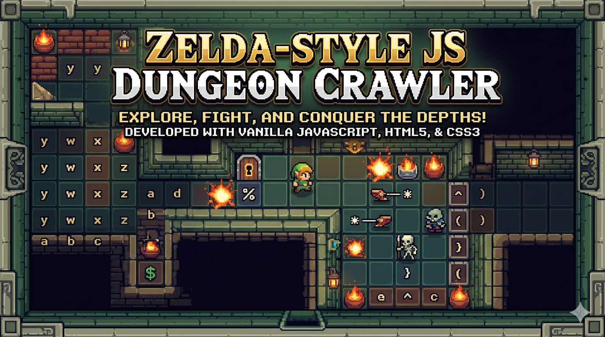

  

<h2>Descripción</h2>

Este proyecto es un motor de juego de mazmorras en 2D desarrollado íntegramente con <b>Vanilla JavaScript</b>, <b>HTML5</b> y <b>CSS3</b>. El juego implementa mecánicas clásicas de exploración y combate inspiradas en los títulos de aventura de 8-bits. Utiliza un sistema de renderizado basado en el DOM, donde los mapas se generan dinámicamente a partir de matrices de caracteres (Tile-mapping).

<h2>Características Principales</h2>
<ul>
<li><strong>Tile-Based Mapping:</strong> Generación de niveles mediante estructuras de datos en arrays, permitiendo una fácil creación y escalabilidad de mapas.</li>
<li><strong>Sistema de Colisiones:</strong> Lógica personalizada para detectar obstáculos (paredes, objetos) y colisiones entre entidades (jugador vs enemigos).</li>
<li><strong>IA de Enemigos:</strong> Implementación de patrones de movimiento para diferentes tipos de entidades:
<ul>
<li><code>Slicer</code>: Movimiento horizontal constante con rebote en obstáculos.</li>
<li><code>Skeletor</code>: Movimiento vertical con temporizadores de cambio de dirección aleatorios.</li>
</ul>
</li>
<li><strong>Game Loop:</strong> Uso de <code>requestAnimationFrame</code> para una ejecución fluida de las animaciones y movimientos de los enemigos.</li>
<li><strong>Estado del Juego:</strong> Persistencia de puntaje, niveles y conteo de enemigos en tiempo real a través del DOM.</li>
</ul>

<h2>Instrucciones de Juego</h2>

El objetivo es limpiar cada nivel de enemigos para desbloquear el acceso a la siguiente etapa.

<table>
<tr>
<th>Acción</th>
<th>Control</th>
</tr>
<tr>
<td>Movimiento</td>
<td><code>Arrow Keys</code> (Arriba, Abajo, Izquierda, Derecha)</td>
</tr>
<tr>
<td>Ataque (Kaboom)</td>
<td><code>Space Bar</code></td>
</tr>
</table>

<h2>Detalles Técnicos</h2>
<h3>Estructura del Mapa</h3>

Los mapas se definen mediante caracteres específicos que el motor interpreta para renderizar clases CSS:

<code>
'ycc)cc^ccw'

'a      * b'

'xdd)dd)ddz'
</code>

<ul>
<li><code>y, w, x, z</code>: Esquinas de los muros.</li>
<li><code>* / }</code>: Spawning de enemigos (Slicer / Skeletor).</li>
<li><code>^ / $</code>: Puntos de transición (Puertas / Escaleras).</li>
</ul>

<h3>Requisitos de Ejecución</h3>

Al ser un proyecto basado en estándares web modernos, solo se requiere un navegador actualizado (Chrome, Firefox, Edge o Safari). No requiere dependencias externas ni compiladores.

Desarrollado por Miguel Ángel de la Cruz Lázaro.

